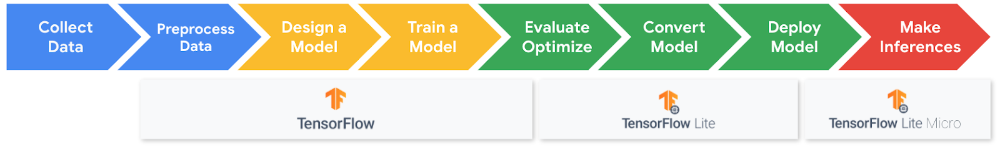

# Applications of TinyML
## 1.4 Machine Learning on Mobile and Edge IoT Devices Part 2

### Quantization
Mapping Float32 to int8, reducing size by  factor of 4 
Post Training quantization is necessary  becasue we want to optimize our models for:
<ul>
    <li>size</li>
    <li>latnecy</li>
    <li>portability</li>
</ul>
the trade-offs are accuracy drops

The tolerability of this accuracy drop is based on application deoplyment use case.
QAT: introduces the measure of accuracy drop and the error by discretizzing the values. The training pipeline can automatically adjust fror this error in the foward pass and backpropgation. 

### TF vs. TFLite
The necessity of the converter

TensorFlow Lite has an increased focus on portability, allowing deployment on different devices and platforms.

### Conversion and Deployment

## 1.5 Keyword Spotting
This is for speech recognition
When you give a machine a command and it 'Awakes" and does something with your next speech to text. Such as "Okay Google" or "Alexa"

Challenges:
<ul>
    <li>Latency and Bandwidth</li>
        
Minimize the amount of data sent over the network
    
    <li>Accuracy </li>
        
Listen continuously

    <li>Personalization</li>
        
Triggeer the user and not background noise

    <li>Privacy</li>
        
Safeguarding tje secirity 

    <li>Battery</li>
        

    <li>Memory</li>
        

</ul>

### Keyword Spotting Architecture:

### KS Datasets:
WHo are the users? Need rich data of audio to train
what do you need? Choosing the rght keyword
What task are you solving? How to interact with ?
How does the real world make this difficult? Background noises need to be accounted for in the dataset and training model

#### Speech Commands: A Dataset for Limited Speech Recognition
Recorded as individual words not sentences
1000-4000 recordings per word
>2,500 volunteers
Recorded with background noise included

TinyMl datasets are much more specific and focussed. THe berevity and size of preexisting datasets are differen tthen what can bne used for TinyML

### Data Collection and Pre-Processing
Sensor Data - 
The wave forms of the audio signal look different and within this signal we must locate the actual word -  THuis is called alignment
Extract critical features. 

Every signal is a composition of different signals. So what we must extract is the signal decomposition.
Fourier (FFt) - What frequencies are present in the signal

Spectograms are created to visualize the signal frequencies.

### A Keyword Spotting Model
The model must be smaler then even the quatiized model.

USE: tiny_conv, 1 convolution layer and one dense layer to ouput layer.

### Training The Model

### Metrics
Which metrics matter?

Accuracy
    Dont want too many False Positives( the keywaord is yess and saying something similar to yess, iss, sss is counted a correct)

ROC Curve - Graphical representation of 
    False Positivv eand Flase Negative
        Accuracy is measured a s a trade off between false accept rate(FAR) and false reject rate(FRR)
        Choose an operating point - the correct location between the two points mentioned above.
            ex. Sensitivity is dependant on device location, native language

Efficiency - Latency
    Must be Fast, cant use too much battery

### Streaming Audio
Detect a word within an complex audio sequence

### Cascade Architecture
the Pipline to deplloy keyword spotting on tinyml
Gives complicated task to more powerfil models and allows fo r better accuracy. Cascade architecture works by having multiple operating points, ex. microcontroller to phone to cloud.
One of the major benefits of cascade architecture is that it prevents us from having to access powerful cloud computing operations every time we need to complete a task, which greatly saves on energy and improves battery lif

## 1.6 Introduction to Data Engineering
Consists of defining requirements, recording data, processing it, and improving the datasets.

### Dataset Standards: Speech Commands
Understanding the operational task that is also 
Data Colection for over 1000 examples for each word
KEY POINT: Usable by everyone

Ability to Compare, Benchmark and Imporove on datasets

### Reading Assignmnet: Speech Commands Paper

### Crowdsourcing Data for the Long Tail

Cost Model v. Community Model
essentially
Limited Scale v. Social Good

[Commonvoice.org](https://commonvoice.mozilla.org/en) - allows for the building of datasets where someone can record their voice and different languages to contribute to a platform designed to build speech recognition

File Structure:
    Valid
    Invalid
    Other

Interesting Attributes
    Permissive License
    Many contributors
    Metadata

### Reusing and Adapting Existing Datasets
Data Collection is Difficult!
Transfer Learning
Pretrained Models: AI DAta LAbeling Assistant
Generate your own data
    Simulations
    ML models

### Responsible Data Collection
Biases

Keyword Spotting Potential Bias:
    Gender
    Age Group
    Accent
    Dialect
    Language

How can you work to avoid bias in your dataset?

## 1.7 Visual Wake Words

Visual Wake Words represents a common TinyML visual use case of identifying whether an object (or a person) is present in the image or not.

### Challenges

