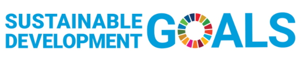

### United Nations
# Sustainable Development Goals

<ol>
    <li>No poverty</li> 
    <li>Zero hunger</li> 
    <li>Good health and well-being</li>
    <li>Quality education</li>
    <li>Gender equality</li>
    <li>Clean water and sanitation</li>
    <li>Affordable and clean energy</li>
    <li>Decent work and economic growth</li>
    <li>Industry, innovation, and infrastructure</li>
    <li>Reduced inequalities</li>
    <li>Sustainable cities and communities</li>
    <li>Responsible consumption and production</li>
    <li>Climate action</li>
    <li>Life below water</li>
    <li>Life on land</li>
    <li>Peace, justice, and strong institutions</li>
    <li>Partnerships</li>
</ol>

Which goal do you think is most important? Why?
How do you think TinyML could be used to achieve this goal?
What ideas have others posted that you are excited about?